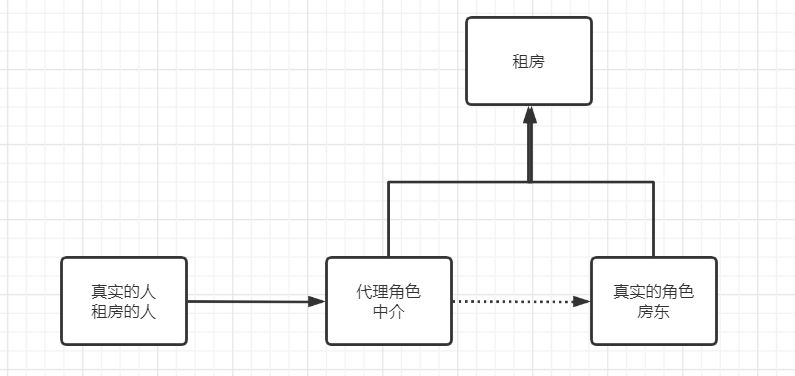
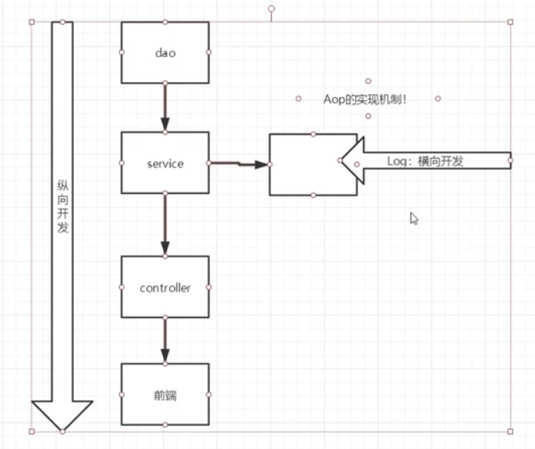

## 常用依赖
```xml
        <dependency>
            <groupId>org.springframework</groupId>
            <artifactId>spring-webmvc</artifactId>
            <version>5.3.22</version>
        </dependency>
        <dependency>
            <groupId>junit</groupId>
            <artifactId>junit</artifactId>
            <version>4.12</version>
            <scope>test</scope>
        </dependency>
```
## bean.xml配置
```xml
<?xml version="1.0" encoding="UTF-8"?>
<beans xmlns="http://www.springframework.org/schema/beans"
       xmlns:xsi="http://www.w3.org/2001/XMLSchema-instance"
       xmlns:context="http://www.springframework.org/schema/context"
       xsi:schemaLocation="http://www.springframework.org/schema/beans
        https://www.springframework.org/schema/beans/spring-beans.xsd
        http://www.springframework.org/schema/context
        https://www.springframework.org/schema/context/spring-context.xsd">


    <context:annotation-config/>
</beans>
```

## 注解说明
- @Autowired: 自动装配通过类型、名字
    如果Autowired不能唯一自动装配上属性，则需要通过@Qualifies(value = "xxx")
- @Resource: 自动装配通过名字、类型
- @Nullable: 字段标记了这个注解，说明这个字段可以为null
- @Component: 组件，放在类上，说明这个类被Spring管理了，就是bean
  - 在web开发，会按照mvc三层架构分层
  - dao【@Repository】
  - service【@Service】
  - controller【@Controller】
  - 这四个注解功能一样，都代表将某个类注册到Spring容器中，然后装配bean
- @Value: 注入值
- @Scope("singleton"): 作用域

## 最佳实践
xml用来管理bean, 注解用来执行属性的注入, 开启注解的支持（扫描包 + 开启注解支持）
```xml
    <!--这个包下的注解就会生效-->
    <context:component-scan base-package="com.fat"/>
    <context:annotation-config/>
```

## aop之前代理模式
- 为什么要学习代理模式？
- 必须要精通代理模式，因为这就是spring aop的底层
- 面向切面编程的底层实现
- 【SpringAOP 和 SpringMVC】必问
- 静态代理 and 动态代理
  


## 静态代理
spring-08-proxy
- 角色分析
  - 抽象角色：一般会使用接口或者抽象类解决
  - 真实角色：被代理的角色
  - 代理角色：代理真实角色，代理真实角色后，我们一般会做一些附属操作
  - 客户：访问代理对象的人

## 代理模式好处
- 可以让真实角色的操作更加纯粹，不用去关注一些公共业务
- 公共业务交给了代理角色，实现了业务的分工
- 公共业务发生扩展的时候，方便集中管理

## 代理缺点
- 一个真实角色就会产生一个代理角色，代码量会翻倍
- 开发效率变低


## 代码步骤
- 1.接口
- 2.真实角色
- 3.代理角色
- 4.客户端访问代理角色

## 聊聊aop

每次代理代码就会翻倍，但是实现了分工，耦合性降低了
又想代理，又不想类增加，使用反射动态加载一些类


## 动态代理
- 动态代理和静态代理角色一样
- 动态代理的代理类是动态生成的，不是我们直接写好的
- 动态代理分为两大类：基于接口的动态代理、基于类的动态代理
  - 基于接口的---JDK的动态代理【我们在这里使用】
  - 基于类：cglib
  - java字节码实现：javasist

需要了解两个类：Proxy代理、InvocationHandler调用处理程序

InvocationHandler：invoke方法
proxy代理谁，method代理什么方法，args什么参数
返回结果（实例类）

Proxy：newProxyInstance

## 动态代理的好处
- 可以让真实角色的操作更加纯粹，不用去关注一些公共业务
- 公共业务交给了代理角色，实现了业务的分工
- 公共业务发生扩展的时候，方便集中管理
- 一个动态代理类代理的是一个接口，一般就是对应的一类业务
- 一个动态代理类可以代理多个类，只要是实现了同一个接口即可（Impl2也一样） 代理的是一类业务


